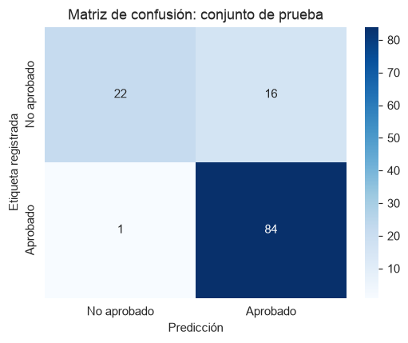

# Análisis de solicitudes de préstamos

**Santiago Lara · Proyecto individual · LEAD University**

## Objetivo

Explorar una muestra de solicitudes de préstamos de vivienda y construir una clasificación introductoria de su estado de aprobación.

## Trabajo realizado

- Exploración de 614 solicitudes, revisión de nulos y preparación de un archivo limpio.
- Estadísticas descriptivas y gráficos de ingresos, montos, historial crediticio y aprobación.
- Separación estratificada de entrenamiento y prueba: 491 y 123 solicitudes, respectivamente.
- Imputación, codificación de categorías y normalización ajustadas únicamente con entrenamiento.
- Regresión logística comparada con una predicción de clase mayoritaria.

## Resultados

| Modelo | Exactitud en prueba | Exactitud balanceada |
| --- | ---: | ---: |
| Clase mayoritaria | 69,1% | 50,0% |
| Regresión logística | 86,2% | 78,4% |

La matriz muestra **22 rechazos y 84 aprobaciones correctamente clasificados**. El modelo confunde 16 rechazos con aprobaciones y una aprobación con rechazo. Esto permite observar errores que la exactitud global no muestra por sí sola.

Los resultados corresponden a una única división de una muestra pequeña. La etiqueta representa **aprobación histórica, no impago**. Es un ejercicio académico; una aplicación real necesitaría validación externa y evaluación de sesgos.

## Ver el trabajo

[Abrir el análisis completo, con código y gráficos](analisis_prestamos.ipynb) · [Datos y fuente](DATOS.md)

El archivo `loan_sanction_train.csv` está incluido. Para reproducir el análisis, seguir las instrucciones de la [página principal](../README.md).
