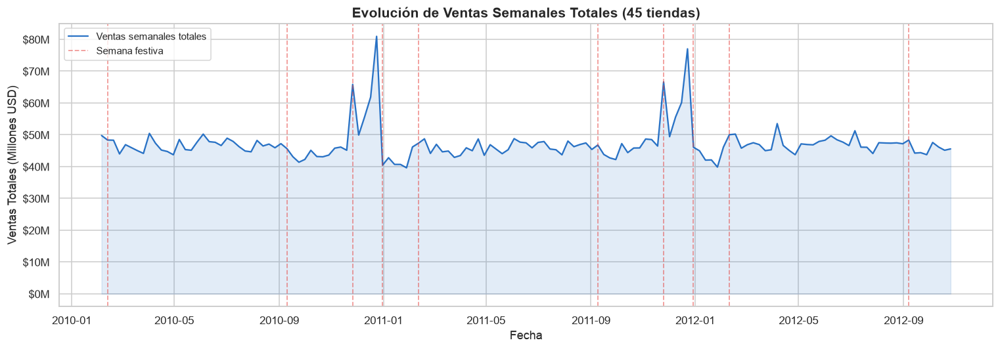

# Análisis exploratorio de ventas

**Santiago Lara · Proyecto individual · LEAD University**

## Objetivo

Explorar cómo varían las ventas semanales entre tiendas y períodos, y describir su asociación con semanas festivas y variables del entorno.

## Trabajo realizado

- Revisión de tipos, fechas, valores faltantes y duplicados.
- Creación de variables temporales y agrupaciones por tienda, mes y trimestre.
- Estadísticas descriptivas, distribuciones, correlaciones y nueve visualizaciones.
- Comparación de la cobertura de cada año para evitar interpretar períodos parciales como años completos.

## Resultados

La muestra contiene **6.435 registros de 45 tiendas**, entre el 5 de febrero de 2010 y el 26 de octubre de 2012. La tienda 20 acumula el mayor volumen y las diez primeras reúnen el **39,1%** de las ventas de la muestra.

Las semanas marcadas como festivas tienen una venta media **7,8% superior** a las no festivas. La comparación describe una asociación; no mide un efecto causal. Las diferencias entre tiendas y períodos pueden orientar preguntas sobre inventario, pero requieren información adicional por producto y costos para formular una decisión comercial.

## Ver el trabajo

[Abrir el análisis completo, con código y gráficos](analisis_ventas.ipynb) · [Datos y fuente](DATOS.md)

El archivo `Walmart_Sales.csv` está incluido. Para reproducir el análisis, seguir las instrucciones de la [página principal](../README.md).
